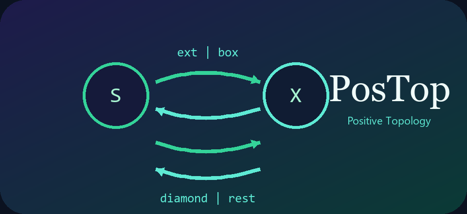

<p align="center">
  
</p>

<p align="center">
  <a href="https://github.com/Mircus/PosTop/actions/workflows/tests.yml">
    
  </a>
  <a href="https://github.com/Mircus/PosTop/actions/workflows/lint.yml">
    
  </a>
</p>

# PosTop

PosTop is a small reference implementation of the forcing-matrix view of
**Positive Topology**, accompanying the paper *"Positive Topology and
Feasible Refinement: Forcing Matrices, Positivity, and Information"*
(Mannucci & Sambin, September 2026). From one incidence relation
`x ⊩ a` between points and observables, two canonical Galois adjunctions
fall out and induce **cover** (what implies what), **positivity** (what's
witnessed/realizable), **saturation**, and **reduction** — each with
witness/counterexample certificates you can inspect, not just a bare
bool.

This is a reference/research implementation, not a finished AI reasoning
framework. See "What is experimental / programmatic" below for exactly
where the established math stops and the sketch begins.

## Mathematical core

```
              forcing / incidence relation  x ⊩ a
                             │
          ┌──────────────────┴──────────────────┐
          │                                      │
   ext ⊣ box                              diamond ⊣ rest
   (universal / cover)                    (existential / positivity)
          │                                      │
   a ◁ U  "a implies something in U"      a ⋉ U  "a has a witness confined to U"
          │                                      │
  saturation = box ∘ ext                reduction = diamond ∘ rest
  (formal opens, paper 𝒜)                (formal closed codes, paper 𝒥)
```

The **compatibility axiom** ties the two sides together and is what makes
refinement sound:

```
(a ◁ U) ∧ (a ⋉ V)  ⟹  ∃ u ∈ U. u ⋉ V
```
Refinement preserves witnesses. In the point-derived case below this is a
*proven theorem*; PosTop also ships a primitive/pointfree interface where
it is instead an *axiom* a caller supplies data for (see "Two ways to get
a Positive Topology").

## What is implemented

Established, tested, directly matching the paper (§1–8):

- `ForcingRelation` — the incidence matrix `x ⊩ a`
- `IncidenceSystem` — `ext`, `box`, `diamond`, `rest`, `saturation`,
  `reduction`, `covers`, `positive`, all derived from a forcing relation
- `FormalPositiveTopology` — the primitive/pointfree case: cover and
  positivity supplied directly, with a `validate_compatibility` check
- Singleton reconstruction of the forcing table from `ext` or `diamond`
  alone (paper Theorem 8.1)
- Witness/counterexample **certificates** (`CoverCertificate`,
  `PositivityCertificate`, `CompatibilityCertificate`, …) — JSON-
  serializable, so a caller gets the *why*, not just the *whether*
- An `Evaluator` facade combining cover + positivity into one result

## What is experimental / programmatic

The paper is explicit that its resource-bounded material (§9) is *"a
programmatic sketch"*, not a finished resource logic. The code mirrors
that distinction:

| Status | What | Where |
|---|---|---|
| **Experimental** | Budgeted forcing with truth/cost kept separate (`forces` vs. `verification_cost`) | `postop.costs.CostAnnotatedIncidence` |
| **Experimental** | Legacy scalar-cost forcing (cost-as-truth conflation — kept for compatibility) | `postop.costs.CostForcing` / `CostPosTop` |
| **Experimental** | A "cheapest next test" heuristic — never claimed optimal | `CostPosTop.suggest_next_test` |
| **Programmatic / future paper** | Generic `V`-valued threshold semantics, coherent threshold maps, resource-indexed positive sites, TROPOS, RB-CwF / graded logical semantics | `postop.costs.ThresholdSemantics` (a `Protocol` skeleton only) |

**Important, and load-bearing for how you use this code:** budgeted
forcing is monotone in the budget, but the *induced* cover and positivity
are **not** — a higher budget can make a cover claim fail that held at a
lower budget, or make a positivity witness disappear, or produce a new
one. `tests/test_costs.py` has concrete counterexamples in both
directions. Do not build logic that assumes "more budget ⟹ at least as
much holds" for cover/positivity.

## Two ways to get a Positive Topology

The survey distinguishes two cases, and PosTop keeps them as two classes
rather than one that quietly conflates them:

- **`IncidenceSystem`** (point-derived): you have a concrete forcing
  table; cover and positivity are *derived* via the adjunctions, and
  compatibility is a *theorem*.
- **`FormalPositiveTopology`** (primitive/pointfree): you supply cover
  and positivity directly as data/callables, with no underlying points
  at all; compatibility is an *axiom* you validate for your instance.

`IncidenceSystem.to_formal_positive_topology()` bridges the two, so the
same validators can run against either.

## 60-second example

```python
from postop import IncidenceSystem, from_dict

forcing = from_dict({
    "patient_1": ["fever", "cough", "fatigue"],
    "patient_2": ["fever", "headache", "fatigue"],
    "patient_3": ["cough", "runny_nose"],
})

system = IncidenceSystem(forcing)

print(system.covers("fever", {"fever", "cough"}))     # True
print(system.positive("fever", {"fever", "cough", "fatigue"}))  # True

cert = system.explain_cover("fever", {"cough"})
print(cert.holds, cert.counterexample)   # False, 'patient_2'
print(cert.to_dict())                    # JSON-serializable
```

## Installation

```bash
python3 -m venv .venv
source .venv/bin/activate      # Windows: .venv\Scripts\Activate.ps1
pip install -e .[dev]
```

## Examples

- [`examples/medical.py`](examples/medical.py) — the running medical-
  diagnosis scenario from the paper
- [`examples/llm_guardrail.py`](examples/llm_guardrail.py) — an
  illustrative adapter (see `postop.adapters`) checking LLM-style claims
  against an `IncidenceSystem`, with an *explicit* hypothesis/observation
  encoding step (an LLM string is not automatically a PosTop generator)

```bash
python examples/medical.py
python examples/llm_guardrail.py
```

Notebooks (see `docs/REPRODUCIBILITY.md` for exact commands):
`notebooks/01_forcing_and_adjunctions.ipynb`,
`notebooks/02_medical_cover_positivity.ipynb`,
`notebooks/03_budgeted_forcing.ipynb`,
`notebooks/04_ai_certificates.ipynb`.

## Tests / invariants

```bash
pip install -e .[dev]
pytest -q
```

The suite checks, among other things: both adjunction laws
(`ext ⊣ box`, `diamond ⊣ rest`) on random finite incidence tables;
saturation extensivity/monotonicity/idempotence; reduction
contractivity/monotonicity/idempotence; the compatibility axiom; the
*correct* formal-closed fixed-point condition `reduction(U) = U` (not the
weaker, automatic `reduction(U) ⊆ U`); singleton reconstruction from
`ext` and from `diamond`; and the cover/positivity budget
non-monotonicity counterexamples described above. No network access or
external services are required.

## Paper / citation

The paper lives at [`docs/Positive_Topology_and_Feasible_Refinemen.pdf`](docs/Positive_Topology_and_Feasible_Refinemen.pdf)
(September 2026 draft). See [`CITATION.cff`](CITATION.cff) for
machine-readable citation metadata, and use GitHub's "Cite this
repository" button, or:

```bibtex
@software{postop2026,
  title  = {PosTop: a reference implementation of Positive Topology},
  author = {Mannucci, Mirco A. and Sambin, Giovanni},
  year   = {2026},
  url    = {https://github.com/Mircus/PosTop}
}
```

An arXiv identifier and DOI will be added here once assigned; none is
claimed until then.

## Project status / roadmap

- **Stable-ish core:** `ForcingRelation`, `IncidenceSystem`,
  `FormalPositiveTopology`, `certificates`. Canonical operator names are
  `ext`/`box`/`diamond`/`rest`/`saturation`/`reduction`; the older
  `Ext`/`Int`/`Hit`/`Sel`/`J`/`j` names still work as deprecated aliases.
- **Experimental:** the resource-bounded layer (`postop.costs`) — usable,
  tested for the non-monotonicity behavior it actually has, but the
  underlying theory is still being developed in a follow-up paper.
- **Not started / research-only:** TROPOS, resource-indexed positive
  sites, coherent threshold maps, RB-CwF — tracked as an open interface
  (`ThresholdSemantics`) only.
- **Not a goal:** turning PosTop into a HYRI-specific package. It stays
  independent; see `docs/ARCHITECTURE.md` for the certificate-based
  interface a system like HYRI could consume without depending on
  PosTop's internals.

See [`CHANGELOG.md`](CHANGELOG.md) for what changed recently, and
[`docs/ARCHITECTURE.md`](docs/ARCHITECTURE.md) for the three-layer
design (kernel / derived operators & certificates / experimental
resource semantics).

## Relationship to knowledge graphs

A knowledge graph represents structured facts and relations; entailment
procedures, provenance, costs, and verification policies can certainly be
layered on top of one. PosTop's contribution is narrower and more
specific: a native grammar of *refinement* — what follows (cover), what
remains witnessable (positivity), and, in the experimental layer, what
can be verified within a resource budget — with the compatibility axiom
guaranteeing refinement doesn't silently lose witnesses along the way.

## License / authors

MIT — see [`LICENSE`](LICENSE) if present in this repository.

Mirco A. Mannucci and Giovanni Sambin. Contributions welcome — see the
project status above for where the boundaries between stable and
research-only code currently sit.
